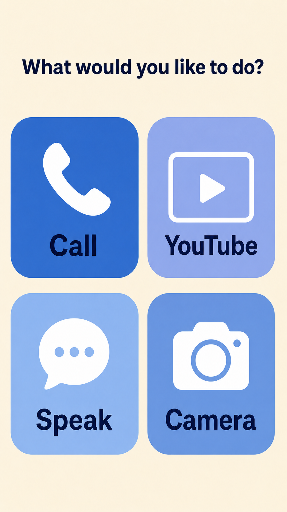
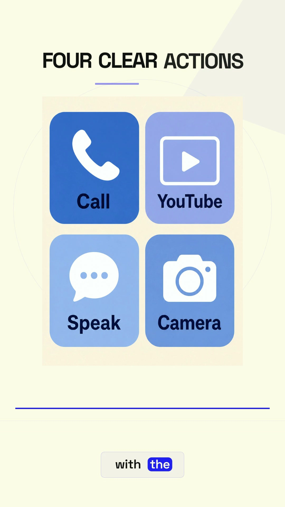

# An Agent for Elders

**An Agent for Elders** is a simple Android app concept that helps older people use a phone with less confusion.

The app gives one clear answer or one clear next step. When it is unsure, it helps the person contact someone they trust.

The repository now includes a small Android UI prototype. It has one screen and
four large buttons. The buttons do not have features yet.

## What the planned home screen looks like



This is a concept image. The Android prototype follows the same simple
two-by-two home-screen layout.

## Watch the concept trailer

This 9:16 video shows how the app could help an older person. It is a concept demonstration, not footage of a finished app.

[](assets/an-agent-for-elders-trailer.mp4)

[Watch the vertical concept trailer](assets/an-agent-for-elders-trailer.mp4)

## Why we want to build it

Phone screens can have small buttons, unclear messages, advertisements, and choices that are easy to press by mistake.

Our goal is not to take control of someone’s phone. Our goal is to make the phone easier to understand while the person stays in control.

## The four main buttons

### Call

Choose a trusted family contact during setup. Tap **Call**, choose the contact,
and confirm before the normal phone dialer opens.

The app does not search for relatives, invent phone numbers, or place a call in
the background.

### YouTube

Tap **YouTube** to open YouTube with simple guidance.

If an advertisement appears, the app can explain: “This is an ad. Your video
has not ended. Please wait.” If an install screen appears, it warns the person
before they continue. It does not block ads or press buttons by itself.

### Speak

Tap **Speak** and talk normally.

The agent can have a simple conversation, answer a question, or search for
current information and show where the answer came from.

### Camera

Tap **Camera** to take a photo of a letter, sign, menu, label, or appliance
button. The app can read it aloud and explain it in simple words.

The camera opens only when the person asks. The app says when a photo is
unclear, and it does not identify people or give medical advice.

## Controls are always close

Every part of the app should include these simple controls:

- **Repeat Slowly**
- **Take Me Home**
- **Stop**

## Our safety promise

- The person using the phone makes the final decision.
- Calls, messages, and photo sharing need clear permission.
- The camera only opens when the person asks for it.
- The full contact list is not sent to the AI.
- The app does not make purchases or medical decisions.
- If the app is unsure, it says so instead of guessing.

## What is in this repository

This repository contains:

- a native Android UI prototype;
- what the app should do;
- how the four main buttons should work;
- privacy and safety rules;
- a three-day hackathon plan;
- 41 example situations we can use to test the future app.

The Android prototype requests no permissions and contains no integrations. It
does not call anyone, open YouTube, record speech, or use the camera yet.

## Run the Android prototype

Open the repository folder in Android Studio and run the `app` configuration on
an Android phone or emulator.

To build from the command line after installing Android SDK Platform 36:

```bash
./gradlew :app:assembleDebug
```

The debug APK will be created at
`app/build/outputs/apk/debug/app-debug.apk`.

## For teammates

Start here:

1. Read [the product plan](plans/PRODUCT.md).
2. Read [the small first version](plans/MVP.md).
3. Follow [the contributor rules](AGENTS.md).
4. Check [the three-day team plan](plans/THREE_DAY_PLAN.md).
5. Install local git hooks so **everyone** (including admins) uses PRs, not direct pushes to `main`:

   ```bash
   ./scripts/install-dev-hooks.sh
   ```

6. Read [PR workflow](docs/PR_WORKFLOW.md) (Mac/Windows daily flow + optional Mac hourly Grok PR checker via crontab).

Other useful documents:

- [Safety and privacy](plans/SAFETY_AND_PRIVACY.md)
- [PR workflow](docs/PR_WORKFLOW.md)
- [How family pairing works](plans/PAIRING_PROTOCOL.md)
- [Ideas for later](plans/IDEA_BACKLOG.md)
- [Demo plan](plans/DEMO_PLAN.md)
- [Hackathon checklist](plans/SUBMISSION_CHECKLIST.md)

## Check the project files

If Node.js 20 or newer is installed, run:

```bash
npm test
```

This checks the planning fixtures and confirms that the Android screen has
exactly four buttons, no permissions, and no click handlers. It does **not**
test an agent or any future integration.

## Project name

Use `an-agent-for-elders` as the name inside code, packages, test files, and documentation. The GitHub repository itself can keep its current name.

## License

[MIT](LICENSE)
